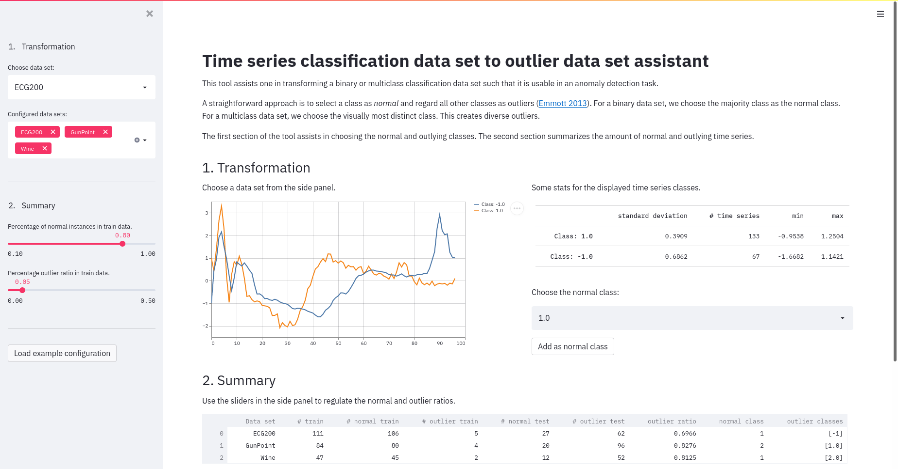

#  Classification- to Anomaly data set Assistant
In the course of my master's thesis, I needed to transform a couple of data sets into an outlier detection setting. Which resulted into the creation of this simple yet useful web app.

## Description
This is a simple tool that assists one in transforming a binary or multi class time series classification data set into an anomaly detection data set.

## Demo
See (here)[https://share.streamlit.io/thiessenh/anomaly-data-helper/main/main.py] for a demo.

## Impressions


## Getting started
To run this app locally, clone it.
```shell
git clone https://github.com/thiessenh/anomaly-data-helper
```
Optionally, create a virtual environment.
```shell
python3 -m venv .venv
source .venv/bin/activate
```
Install the dependencies.
```shell
pip install -r requirements.txt
```
Run the app.
```shell
streamlit run main.py
```
You might add you own data sets. To do so, follow the following steps:
- add you data to `data/<your_data_set_name>`
- add your data set name to the list `DATASETS` in `main.py`
- edit `datasets.json` to suit your data set

## Dependencies
- [streamlit](https://streamlit.io/)
- [pandas](https://pandas.pydata.org/)